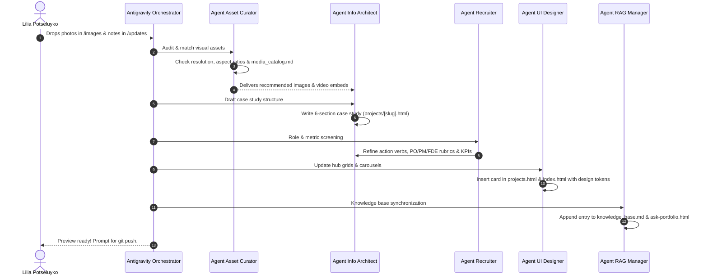

# Multi-Agent Portfolio Orchestration Protocol

This document defines the automated end-to-end pipeline executed by the 5 specialist agents whenever Dr Lilia Potseluyko introduces a new change, project, photo, or research achievement.

---

## The Dynamic Update Pipeline

---

## Step-by-Step Execution Checklist for Agents

### Step 1: Media Curation (`agent_asset_curator`)
1. Read the image filenames provided by Lilia in `updates/*.md` or `images/`.
2. Verify image formats, orientation (16:9 for hero/video, 1:1 or 4:3 for cards), and clarity.
3. Update `agents/media_catalog.md` with the new assets and their tags.
4. Pass the top candidate images with descriptive caption proposals to the Information Architect.

### Step 2: Information Architecture & Drafting (`agent_information_architect`)
1. Create or update `projects/[slug].html` using the standardized case study layout.
2. Structure the copy into the 6 standard sections:
   - Header Meta Box (Role, Timeline, Tools, Stakeholders)
   - 1. Problem & Context (The "Why")
   - 2. Service Discovery & Process (The "Process")
   - 3. Architecture & Prototyping (The "What & How")
   - 4. Interactive Media & Demos (Video / Gallery)
   - 5. Measurable Outcomes & Learnings (KPI cards)
   - Next / Previous Project navigation footer.

### Step 3: Recruiter Quality Gate (`agent_recruiter`)
1. Verify role alignment: Is this framed for Product Owner, Product Manager, Service Designer, or Forward Deployed Engineer?
2. Ensure technical jargon translates into business outcomes (time saved, user count, efficiency gains, contracts won).
3. Ensure active voice throughout (*"I led", "I prototyped", "I delivered"*).

### Step 4: UI & Layout Integration (`agent_ui_designer`)
1. Add the project card into `projects.html` under the appropriate grid pillar.
2. If marked as a homepage feature, update the carousel in `index.html`.
3. Verify CSS classes (`.pillar-card`, `.case-study-hero`, `.video-responsive-wrapper`, `.outcomes-grid`).
4. Ensure dark theme contrast matches `#000000`, `#1DCD9F`, and `#e9008c`.

### Step 5: RAG & Knowledge Base Grounding (`agent_rag_manager`)
1. Append the new project summary, metrics, and tools into `knowledge_base.md`.
2. Add corresponding FAQ Q&A pairs in `knowledge_base.md` under Section 7.
3. Update `portfolioFallbackKB` in `ask-portfolio.html` so the AI assistant immediately answers questions about this new project.

### Step 6: Review & Deployment
1. Validate internal links across pages.
2. Notify Lilia with a summary of modified files.
3. Offer to run `git commit` and `git push origin main` to publish live to GitHub Pages.
