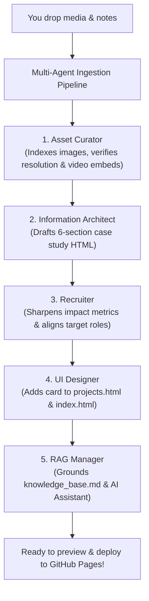

# Portfolio Updates Ingestion Hub

Welcome to your portfolio's dynamic update staging area!

Whenever you have a new project, new sketchbook scans, screenshots, demo videos, or academic achievements, you don't need to manually code HTML or write CSS. 

### How to Add a New Change in 3 Steps:

1. **Drop Your Media:**
   - Put your new images, photos, or screenshots into the `images/` directory.

2. **Fill Out a Quick Template:**
   - For a new project or case study update: Copy [`project_template.md`](project_template.md) and fill in your raw thoughts, bullet points, and links.
   - For a new publication, talk, or workshop: Copy [`academic_template.md`](academic_template.md).

3. **Tell Your Agent Team:**
   - In your chat, simply say:
     > *"Hey, I added a new update in `updates/my-new-project.md`. Run the multi-agent pipeline!"*

---

### What the Agents Will Automatically Do:

